# Delpher Entiteiten Workbench

  <a href="https://www.delpher.nl" title="Delpher"><picture>
    <source media="(prefers-color-scheme: dark)" srcset="assets/media/delpher-logo-dark.svg">
    
  </picture></a>
  &nbsp;&nbsp;&nbsp;
  <a href="https://www.kb.nl" title="KB, nationale bibliotheek"><picture>
    <source media="(prefers-color-scheme: dark)" srcset="assets/media/kb-logo-dark.svg">
    
  </picture></a>
  &nbsp;&nbsp;&nbsp;
  
  &nbsp;&nbsp;&nbsp;
  <a href="https://www.wikidata.org" title="Powered by Wikidata">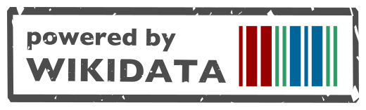</a>

In oude krantenartikelen staan ontelbaar veel namen van 'dingen', denk
bijvoorbeeld aan mensen, schepen, diersoorten, plaatsen en organisaties. Deze
werkbank haalt die entiteiten automatisch uit het artikel, en levert een eerste
suggestie van wat elk ding zou kunnen zijn. Wat er werkelijk klopt bepaal jij,
door elke suggestie na te lopen, te verbeteren wat ernaast zit, en die waar dat
kan te koppelen aan [Wikidata](https://www.wikidata.org). Het materiaal komt uit
[Delpher](https://www.delpher.nl), waarin de
[nationale bibliotheek van Nederland](https://www.kb.nl) miljoenen kranten heeft
gedigitaliseerd en doorzoekbaar gemaakt.

## HackaLOD 2026 en Linked Open Data

De werkbank is gebouwd ter voorbereiding op
[HackaLOD 2026](https://netwerkdigitaalerfgoed.nl/hackalod/) in Middelburg, de
Nederlandse hackathon over digitaal erfgoed die door Netwerk Digitaal Erfgoed
wordt georganiseerd. De LOD in die naam staat voor **Linked Open Data**, en daar
draait het hele evenement om: erfgoedgegevens die niet alleen vrij te gebruiken
zijn, maar die ook naar elkáár verwijzen. Het verschil zit hem in wat er precies
wordt vastgelegd — niet "hier staat de tekst *Max Weber*", maar "hier wordt díé
Max Weber bedoeld, dezelfde als in dat andere bestand", zodat een computer
verbanden kan leggen die anders alleen een mens ziet.

## De Siboga-expeditie

Het onderwerp is de **Siboga-expeditie**, de Nederlandse zeeonderzoeksexpeditie
die in 1899 en 1900 door de Indonesische archipel voer.
Wat die expeditie een goed onderwerp maakt, is dat haar opbrengst over heel
verschillende soorten instellingen verspreid is geraakt. De verzamelde dieren en
planten gingen in glazen potten en zinken kisten naar het Zoölogisch
Laboratorium in Amsterdam, en de etnografica die onderweg zijn verworven
bevinden zich in het Koninklijk Instituut voor de Tropen. Er kwamen 28
detailkaarten van ankerplaatsen, zeestraten en eilandengroepen uit voort, twee
zeekaarten met dieptemetingen, honderd hydrografische aantekeningen en een
expeditiejournaal met 323 meetstations. De wetenschappelijke uitkomsten
verschenen als 148 monografieën van 61 onderzoekers uit tien landen, waarvan de
laatste pas in 1986 uitkwam — ruim tachtig jaar na thuiskomst. Anna Weber-van
Bosse, een van de drie vrouwen aan boord, schreef in 1904 haar eigen reisverslag
*Een jaar aan boord H.M. Siboga*. En Nederland volgde het allemaal thuis in de
krant.

Al dat materiaal ligt bij andere instellingen, in andere systemen, met andere
manieren om op te schrijven over wie of wat iets gaat. Tijdens het evenement
willen we die bronnen aan elkaar knopen en er iets mee bouwen.

## Delpher als Linked Open Data

Van al die bronnen leveren de krantenartikelen een eigen uitdaging op, want een
krant is platte tekst: een naam erin is een rijtje letters en verder niets. Daar
is deze werkbank de voorbereiding op. Door zo'n naam te koppelen aan een item in
[Wikidata](https://www.wikidata.org) — en Wikidata is zelf Linked Open Data —
wordt dat rijtje letters een verwijzing die andere collecties óók begrijpen. Zo
worden de Delpher-artikelen onderdeel van de **Linked Open Data cloud** — alle
verzamelingen ter wereld die op die manier naar elkaar verwijzen, en waarin
Wikidata een veelgebruikt ankerpunt is. Daarmee zijn ze op de hackathon gewoon
te combineren met de specimens, de kaarten, de etnografica en de archiefstukken
over dezelfde expeditie.

## Hoe werkt het?

Je werkt per onderwerp, en zo'n onderwerp heet in de app een **project**: het
heeft zijn eigen artikelen, zijn eigen lijst met namen en zijn eigen
beslissingen, en niets daarvan loopt over naar een ander project. Zo kan de
Siboga-expeditie naast een heel andere verzameling staan zonder dat ze elkaar
in de weg zitten.

Het begint met een zoekopdracht bij Delpher. Van elk artikel dat daaruit komt
haalt de app de volledige tekst op, de scan van de krantenpagina waarop het
stond, en de plaats van ieder woord op die scan. Vervolgens gaat hij in die
tekst op zoek naar namen, en daarmee is het automatische deel afgelopen. De rest
doe jij: in de werkbank loop je de gevonden namen langs en bevestig je wat
klopt, verbeter of hernoem je wat ernaast zit, voeg je samen wat hetzelfde
blijkt te zijn en splits je wat toch twee verschillende dingen waren. En als je
zeker weet over wie of wat het gaat, leg je zelf de koppeling met Wikidata,
waarbij de app je alleen helpt met zoeken. Alles wat je beslist wordt
opgeschreven en gedateerd, en je kunt het later altijd weer intrekken.

<!--
De links in de galerij wijzen naar raw.githubusercontent.com, zodat een klik het
plaatje zelf oplevert en niet GitHubs bestandspagina. Ze dragen GEEN
target="_blank": GitHub filtert dat attribuut weg (nagemeten tegen zijn eigen
/markdown-API, die ook rel naar nofollow herschrijft), dus het zou een nieuw
tabblad beloven dat er niet komt.

Op de GitHub Pages-site (kbnlwikimedia.github.io/delpher-entities-workbench)
opent een klik het plaatje juist OVER de pagina heen, in een lichtbak. Die wordt
geladen vanuit _includes/head-custom.html en zoekt zijn eigen links op; er staat
met opzet niets voor in dit bestand. Een <script> of <style> hier zou door
GitHub niet weggegooid maar ZICHTBAAR gemaakt worden, en dan stond de hele
broncode als tekst op deze pagina.
-->

## Zo ziet het eruit

<!-- GALERIJ:START -- gegenereerd, zie scripts/build_readme_gallery.py -->
De zeventien schermen, in de volgorde waarin je ze tegenkomt. Klik op een afbeelding om hem groot te bekijken.

<table>
<tr>
<td width="50%" valign="top">
<a href="https://raw.githubusercontent.com/KBNLwikimedia/delpher-entities-workbench/refs/heads/main/assets/media/01-uitleg.png">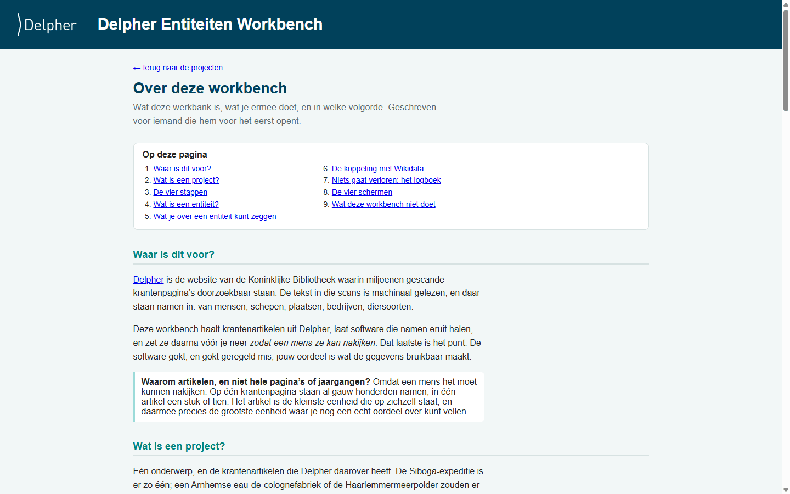</a>
 <b>1 &middot; Eerst even lezen wat dit is</b> 
De pagina ‘Over deze workbench’ legt in gewone taal uit waar de app voor is en in welke volgorde je te werk gaat. Geschreven voor iemand die hem voor het eerst opent.
</td>
<td width="50%" valign="top">
<a href="https://raw.githubusercontent.com/KBNLwikimedia/delpher-entities-workbench/refs/heads/main/assets/media/02-overzicht.png">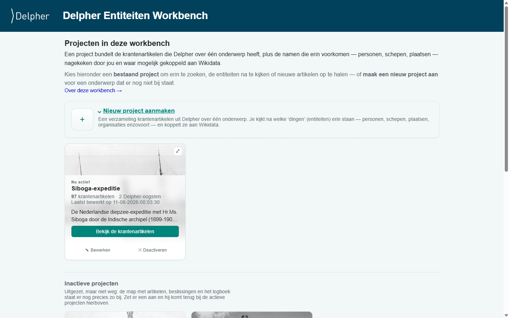</a>
 <b>2 &middot; Al je projecten op een pagina</b> 
Een tegel per onderwerp, met het eigen logo erachter en hoeveel krantenartikelen erin zitten. Onder de streep staan de projecten die je hebt uitgezet: die zijn uit de app, maar op je schijf staat alles nog.
</td>
</tr>
<tr>
<td width="50%" valign="top">
<a href="https://raw.githubusercontent.com/KBNLwikimedia/delpher-entities-workbench/refs/heads/main/assets/media/03-nieuw-project.png">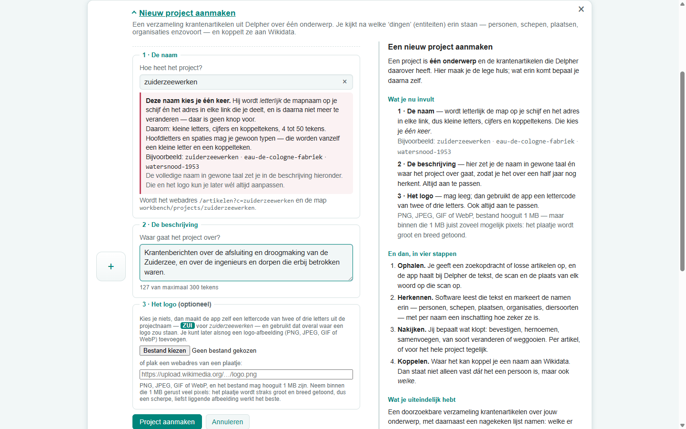</a>
 <b>3 &middot; Een nieuw project beginnen</b> 
Onder het naamveld staat wat die naam gaat worden: het webadres, en de map op je schijf. Bij het logo zie je alvast de lettercode die je krijgt als je er geen kiest — hier <code>ZUI</code>. Rechts staan de vier stappen die je daarna doorloopt.
</td>
<td width="50%" valign="top">
<a href="https://raw.githubusercontent.com/KBNLwikimedia/delpher-entities-workbench/refs/heads/main/assets/media/04-galerij.png">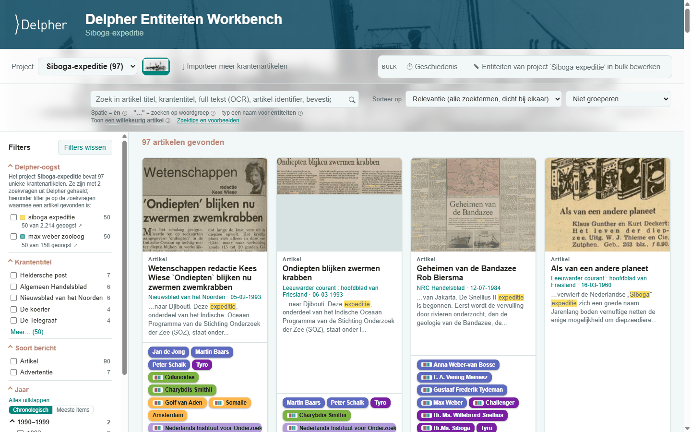</a>
 <b>4 &middot; De krantenartikelen van een project</b> 
Links de kolom om mee te filteren. Op elk kaartje staan de scan van de krantenpagina, het stukje tekst waarin je zoekwoord voorkomt, en de namen die iemand in dat artikel heeft goedgekeurd.
</td>
</tr>
<tr>
<td width="50%" valign="top">
<a href="https://raw.githubusercontent.com/KBNLwikimedia/delpher-entities-workbench/refs/heads/main/assets/media/05-zoeksuggesties.png">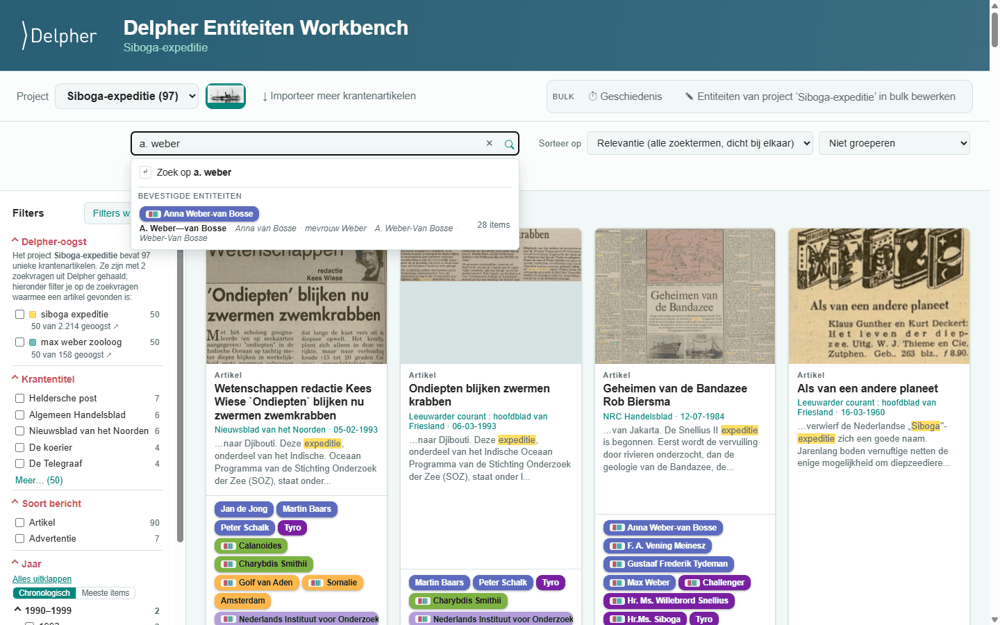</a>
 <b>5 &middot; Typen in het zoekvak</b> 
De bovenste regel zoekt gewoon op die letters. Daaronder wordt Anna Weber-van Bosse aangeboden als naam — gevonden op een schrijfwijze die in de kranten staat, met het merkje van Wikidata omdat vaststaat wie ze is, en goed voor 28 artikelen.
</td>
<td width="50%" valign="top">
<a href="https://raw.githubusercontent.com/KBNLwikimedia/delpher-entities-workbench/refs/heads/main/assets/media/06-filteren.png">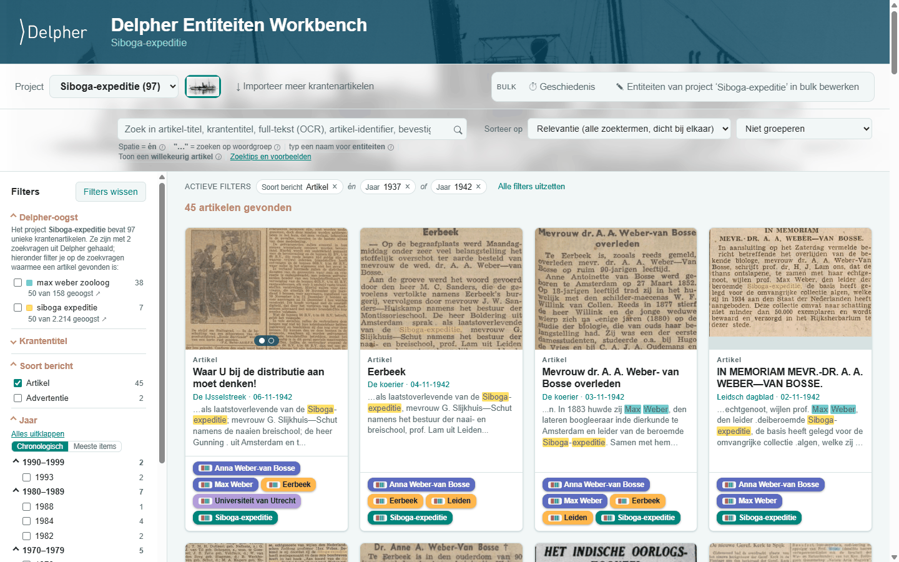</a>
 <b>6 &middot; Filteren met de kolom links</b> 
Achter elk vinkje staat hoeveel artikelen er overblijven als je het aanzet. Hier staan twee jaren en een soort bericht tegelijk aan. Alles wat je aanvinkt komt in het webadres te staan, dus je kunt precies dit beeld doorsturen.
</td>
</tr>
<tr>
<td width="50%" valign="top">
<a href="https://raw.githubusercontent.com/KBNLwikimedia/delpher-entities-workbench/refs/heads/main/assets/media/07-groeperen.png">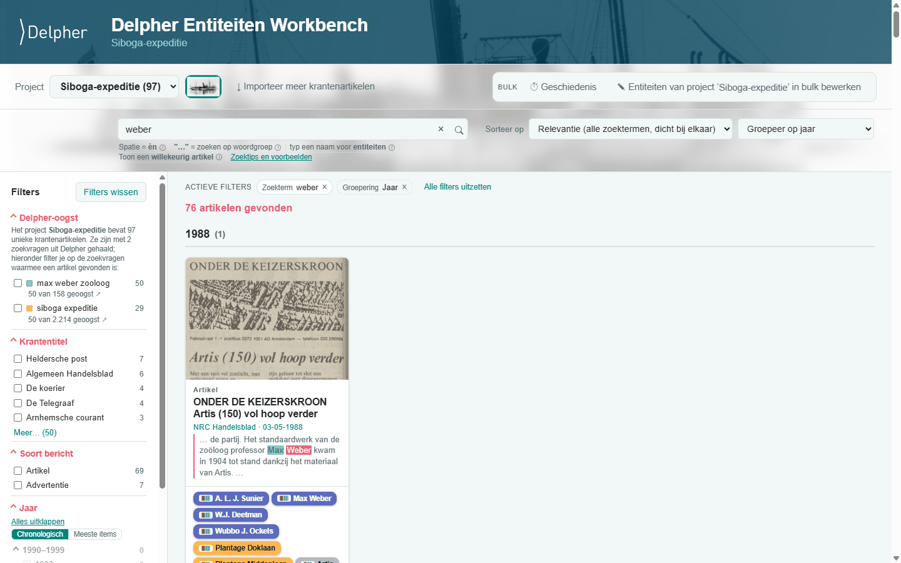</a>
 <b>7 &middot; De uitkomst per jaar bij elkaar</b> 
Dezelfde zoekopdracht, maar nu op jaar gegroepeerd. Zo zie je wanneer er over je onderwerp geschreven werd, in plaats van alleen hoeveel.
</td>
<td width="50%" valign="top">
<a href="https://raw.githubusercontent.com/KBNLwikimedia/delpher-entities-workbench/refs/heads/main/assets/media/08-lezer.png">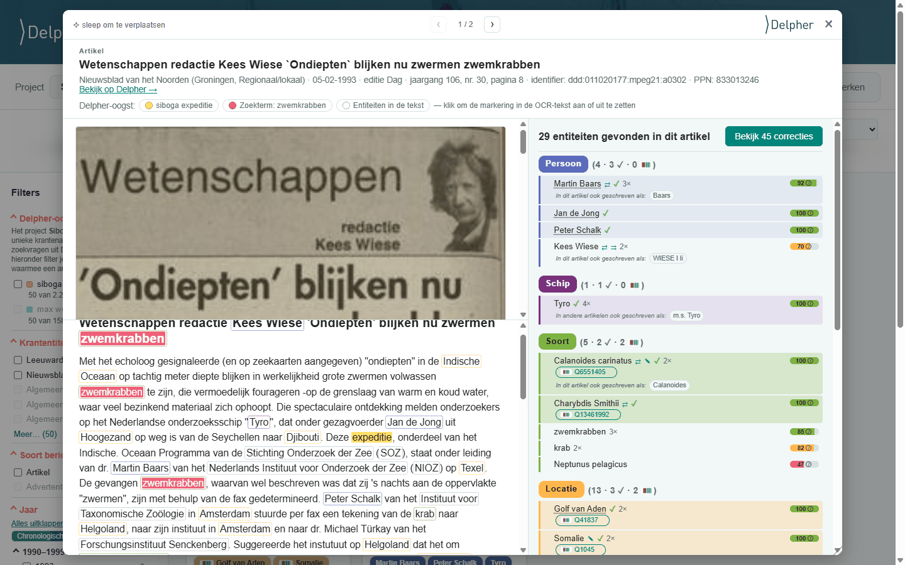</a>
 <b>8 &middot; Een artikel lezen</b> 
Linksboven de scan van de krantenpagina, daaronder de tekst met om elke naam een lijntje in de kleur van zijn soort, en rechts alle namen op soort gegroepeerd. Per naam zie je hoe zeker de herkenning is, welke schrijfwijzen dit artikel gebruikt, en het Wikidata-nummer als dat is goedgekeurd.
</td>
</tr>
<tr>
<td width="50%" valign="top">
<a href="https://raw.githubusercontent.com/KBNLwikimedia/delpher-entities-workbench/refs/heads/main/assets/media/09-lichtbak.png">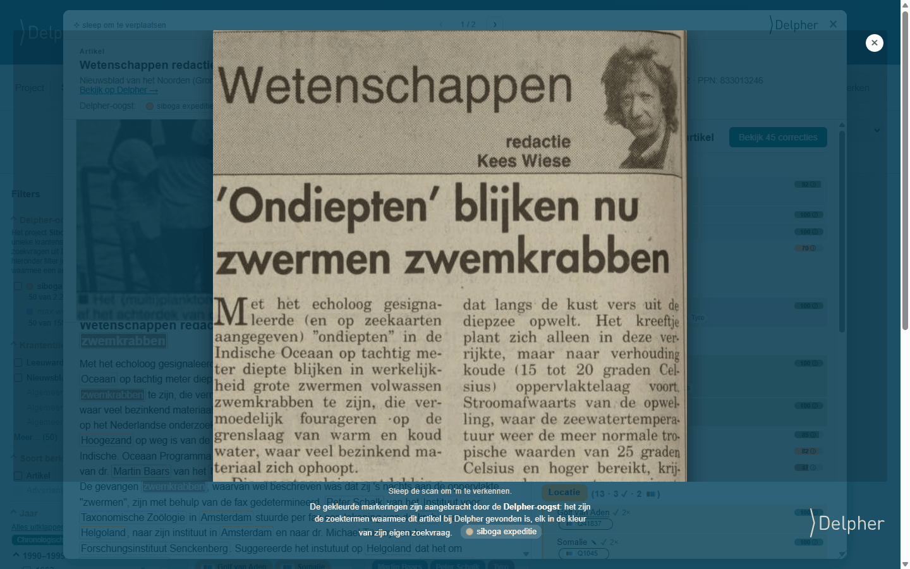</a>
 <b>9 &middot; De scan op ware grootte</b> 
Klik op de scan en hij komt schermvullend over de rest heen, om te verslepen. De gekleurde markeringen zijn de zoekwoorden waarmee dit artikel bij Delpher gevonden is, elk in de kleur van zijn eigen zoekopdracht.
</td>
<td width="50%" valign="top">
<a href="https://raw.githubusercontent.com/KBNLwikimedia/delpher-entities-workbench/refs/heads/main/assets/media/10-bevestigen.png">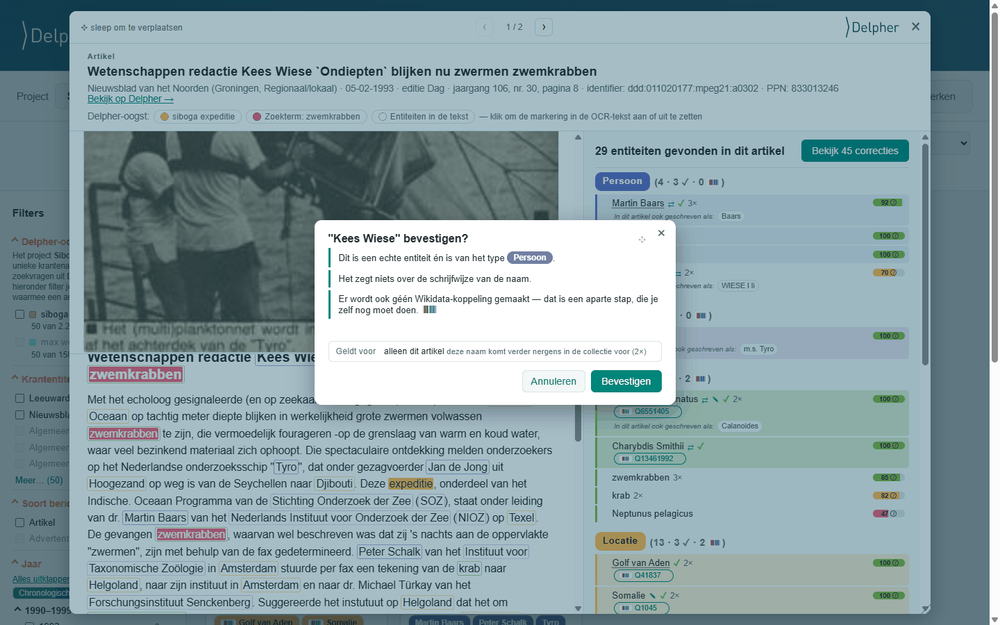</a>
 <b>10 &middot; Het ene venster waar elke wijziging langs gaat</b> 
Het zegt wat het gaat vastleggen en ook wat het met opzet niet doet. De laatste regel voor de knoppen is elke keer dezelfde keuze: alleen dit artikel, of alle artikelen — met erbij hoe vaak de naam voorkomt, zodat die tweede keuze een getal is en geen gok.
</td>
</tr>
<tr>
<td width="50%" valign="top">
<a href="https://raw.githubusercontent.com/KBNLwikimedia/delpher-entities-workbench/refs/heads/main/assets/media/11-correcties-artikel.png">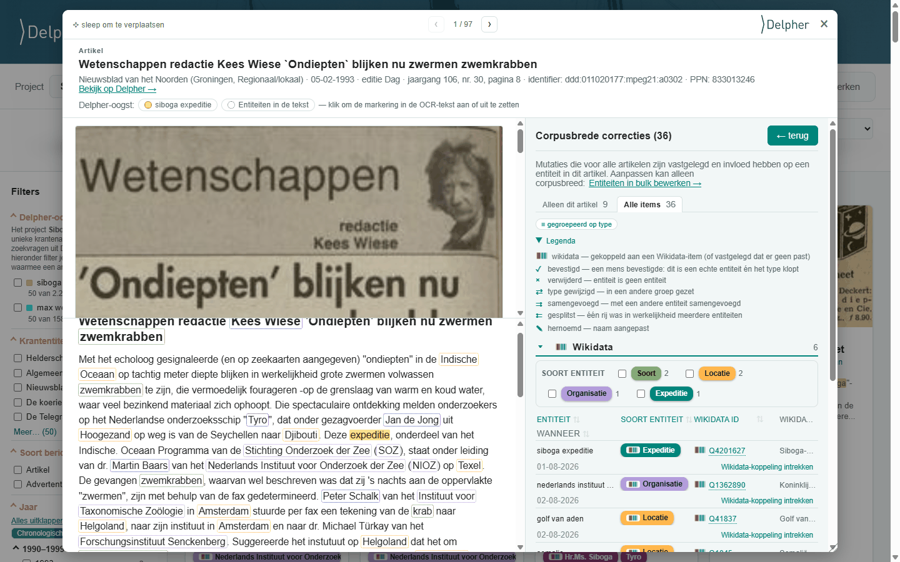</a>
 <b>11 &middot; Wat er al besloten is over dit artikel</b> 
Naast de tekst zie je welke eerdere beslissingen op dit artikel doorwerken, met een legenda van de zeven soorten die je kunt nemen. Elke regel is met een klik weer in te trekken.
</td>
<td width="50%" valign="top">
<a href="https://raw.githubusercontent.com/KBNLwikimedia/delpher-entities-workbench/refs/heads/main/assets/media/12-entiteiten.png">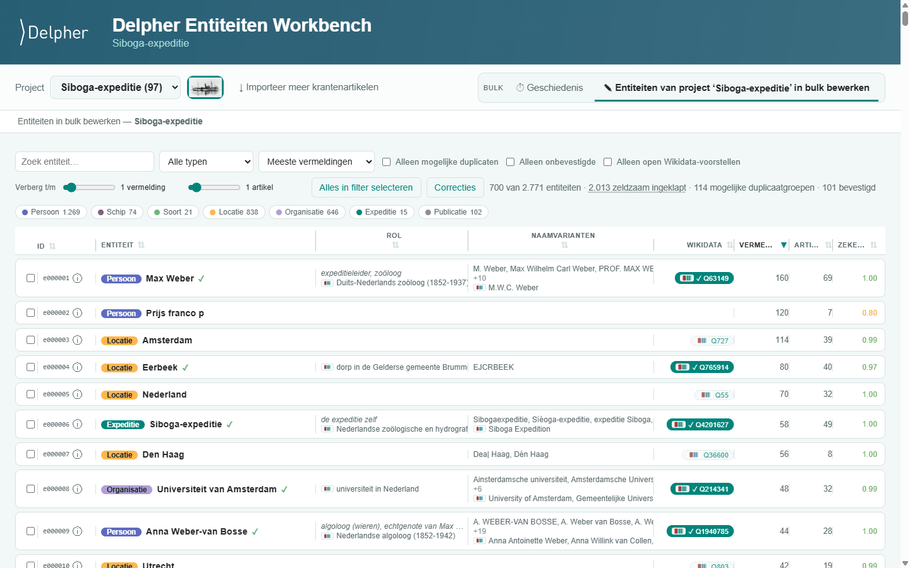</a>
 <b>12 &middot; Alle namen van een project in een lijst</b> 
Een regel per naam, met de soort, wat Wikidata erover zegt, alle schrijfwijzen die in de kranten staan, het goedgekeurde nummer en hoe vaak de naam voorkomt. Hier werk je een heel project door in plaats van een artikel.
</td>
</tr>
<tr>
<td width="50%" valign="top">
<a href="https://raw.githubusercontent.com/KBNLwikimedia/delpher-entities-workbench/refs/heads/main/assets/media/13-dubbelen.png">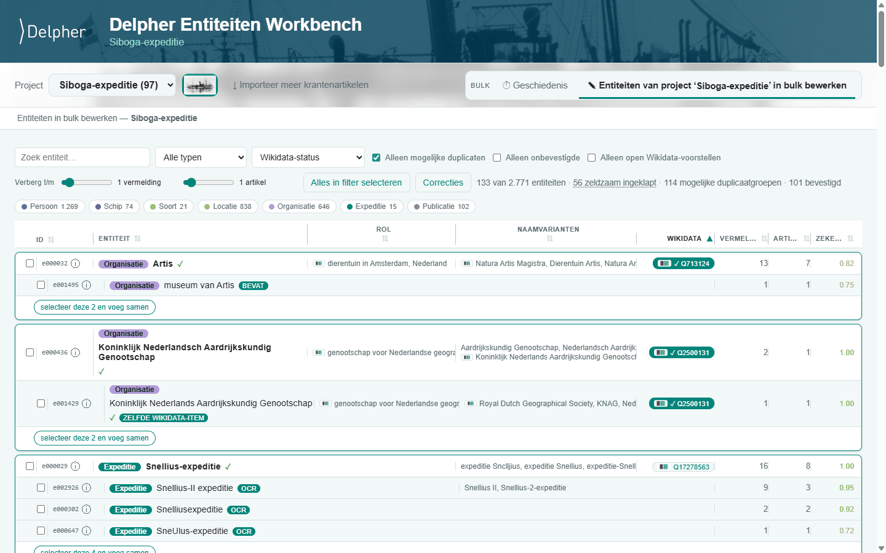</a>
 <b>13 &middot; Namen die op elkaar lijken, bij elkaar</b> 
De app zet namen die waarschijnlijk hetzelfde zijn bij elkaar, zodat je ze in een keer kunt samenvoegen. Vaak zijn het leesfouten in de scan: <code>Snellius-expeditie</code> staat er ook als <code>Snelliusexpeditie</code> en <code>SneUlus-expeditie</code>.
</td>
<td width="50%" valign="top">
<a href="https://raw.githubusercontent.com/KBNLwikimedia/delpher-entities-workbench/refs/heads/main/assets/media/14-entiteit-paneel.png">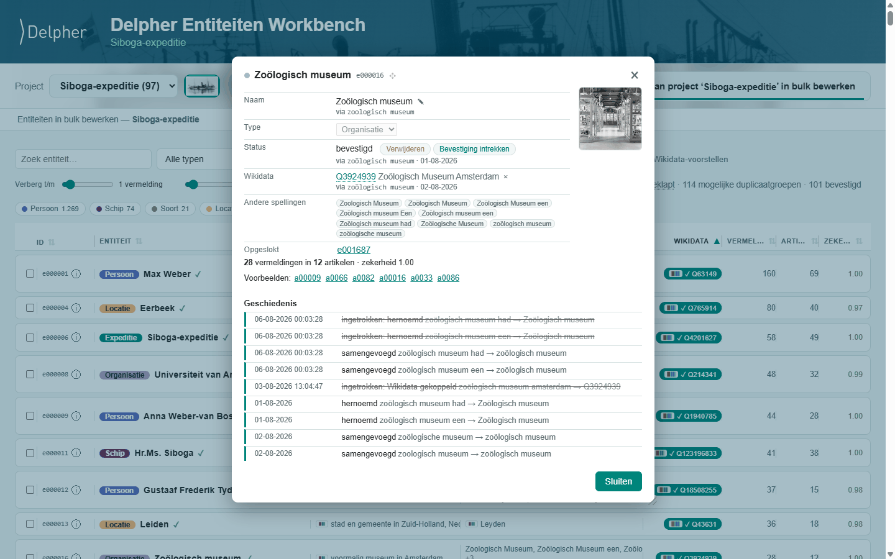</a>
 <b>14 &middot; Een naam, van dichtbij</b> 
De velden die je kunt aanpassen, de foto waar Wikidata naar wijst, alle schrijfwijzen, en onderaan de geschiedenis. Dat laatste staat nergens anders: de lijst met beslissingen bewaart alleen wat er nu geldt.
</td>
</tr>
<tr>
<td width="50%" valign="top">
<a href="https://raw.githubusercontent.com/KBNLwikimedia/delpher-entities-workbench/refs/heads/main/assets/media/15-correcties.png">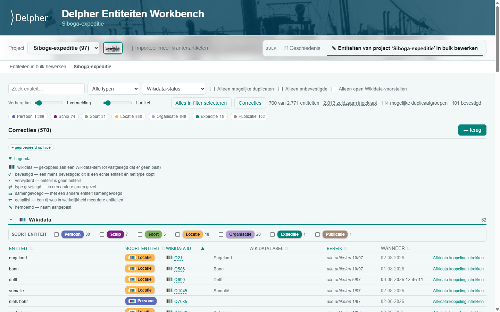</a>
 <b>15 &middot; Alles wat er ooit besloten is</b> 
Elke beslissing die iemand ooit nam, gegroepeerd op soort en te sorteren. Per regel staat hoe ver hij reikt en wanneer hij genomen is — en je kunt hem hier weer intrekken.
</td>
<td width="50%" valign="top">
<a href="https://raw.githubusercontent.com/KBNLwikimedia/delpher-entities-workbench/refs/heads/main/assets/media/16-geschiedenis.png">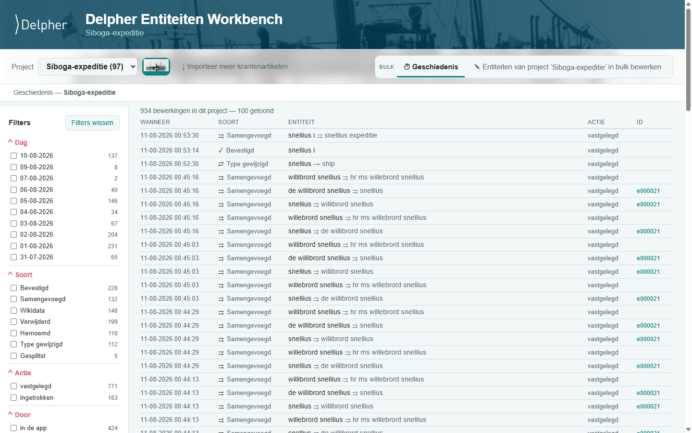</a>
 <b>16 &middot; Het logboek, op volgorde van tijd</b> 
Hetzelfde verhaal maar dan chronologisch: wat er gebeurd is, wanneer, en door wie. Er wordt alleen aan toegevoegd en nooit in geschrapt, dus je kunt altijd terugzien hoe iets zo gekomen is.
</td>
</tr>
<tr>
<td width="50%" valign="top">
<a href="https://raw.githubusercontent.com/KBNLwikimedia/delpher-entities-workbench/refs/heads/main/assets/media/17-voettekst.png">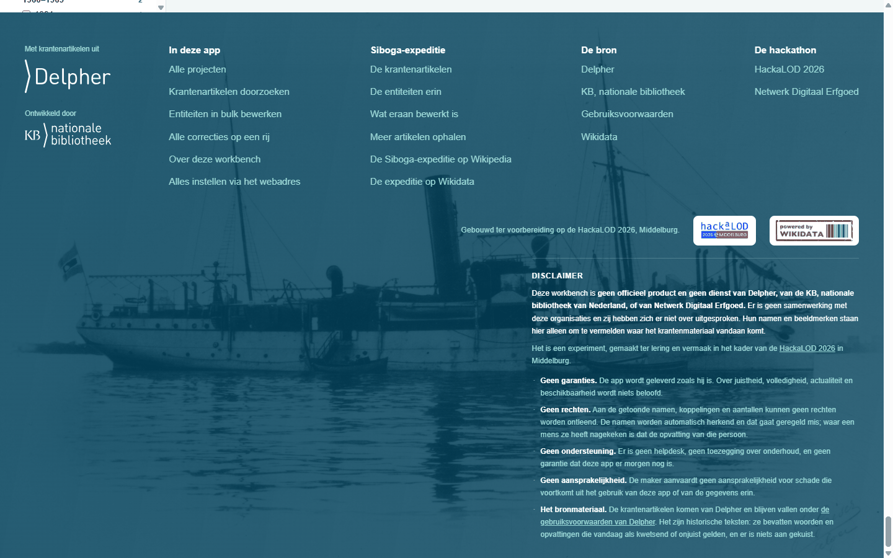</a>
 <b>17 &middot; En onderaan elke pagina de vrijwaring</b> 
Deze workbench is geen product van Delpher of van de KB, hoe vaak hun beeldmerken hier ook staan. Wat er dan wél is en wat je er niet aan mag ontlenen staat in de voettekst, op elke pagina, ook op de twee die verder helemaal geen app zijn.
</td>
</tr>
</table>
<!-- GALERIJ:EINDE -->

## Waar de code staat

Voorlopig niet hier. Het is onderzoeksgereedschap dat nog volop in ontwikkeling
is en dat op één computer draait, samen met alle krantenartikelen die er
inmiddels in zijn opgehaald en alle beslissingen die erover genomen zijn. Of de
code openbaar wordt, is een keuze voor later.

## Waar deze repo dan wél voor is

Dit is het meldpunt. Fouten, wensen en open vragen worden verzameld bij
[Issues](https://github.com/KBNLwikimedia/delpher-entities-workbench/issues), en
dat is op dit moment het hele doel van deze repo. Een melding is dus welkom,
ook al kun je de code waar hij over gaat nog niet inzien.

## Het materiaal

De artikelteksten, de scans en de automatisch uitgelezen tekst komen van Delpher
en de KB, en daarvoor gelden
[de gebruiksvoorwaarden van Delpher zelf](https://www.delpher.nl/over-delpher/gebruiksvoorwaarden).
Op de afbeeldingen hierboven zie je dat materiaal in die context terug. De namen
die eruit voortkomen worden gekoppeld aan Wikidata, dat onder CC0 valt en dus
vrij te gebruiken is.

## Disclaimer

Deze workbench is **geen officieel product en geen dienst van Delpher, van de
KB, nationale bibliotheek van Nederland, of van Netwerk Digitaal Erfgoed.** Er
is geen samenwerking met deze organisaties en zij hebben zich er niet over
uitgesproken. Hun namen en beeldmerken staan hier alleen om te vermelden waar
het krantenmateriaal vandaan komt.

Het is een experiment, gemaakt ter lering en vermaak in het kader van de
[HackaLOD 2026](https://netwerkdigitaalerfgoed.nl/hackalod/) in Middelburg.

- **Geen garanties.** De app wordt geleverd zoals hij is. Over juistheid,
  volledigheid, actualiteit en beschikbaarheid wordt niets beloofd.
- **Geen rechten.** Aan de getoonde namen, koppelingen en aantallen kunnen geen
  rechten worden ontleend. De namen worden automatisch herkend en dat gaat
  geregeld mis; waar een mens ze heeft nagekeken is dat de opvatting van die
  persoon.
- **Geen ondersteuning.** Er is geen helpdesk, geen toezegging over onderhoud,
  en geen garantie dat deze app er morgen nog is.
- **Geen aansprakelijkheid.** De maker aanvaardt geen aansprakelijkheid voor
  schade die voortkomt uit het gebruik van deze app of van de gegevens erin.
- **Het bronmateriaal.** De krantenartikelen komen van Delpher en blijven
  vallen onder
  [de gebruiksvoorwaarden van Delpher](https://www.delpher.nl/over-delpher/gebruiksvoorwaarden).
  Het zijn historische teksten: ze bevatten woorden en opvattingen die vandaag
  als kwetsend of onjuist gelden, en er is niets aan gekuist.

## Licentie

De code valt onder de voorwaarden in [LICENSE](LICENSE), terwijl het opgehaalde
krantenmateriaal onder de voorwaarden van Delpher en de KB blijft vallen.

---

<!-- LAATST-GEWIJZIGD -->
Laatst bijgewerkt: 2026-08-11 · de afbeeldingen hierboven zijn van die datum.
