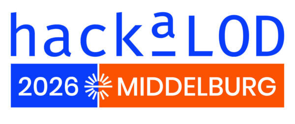
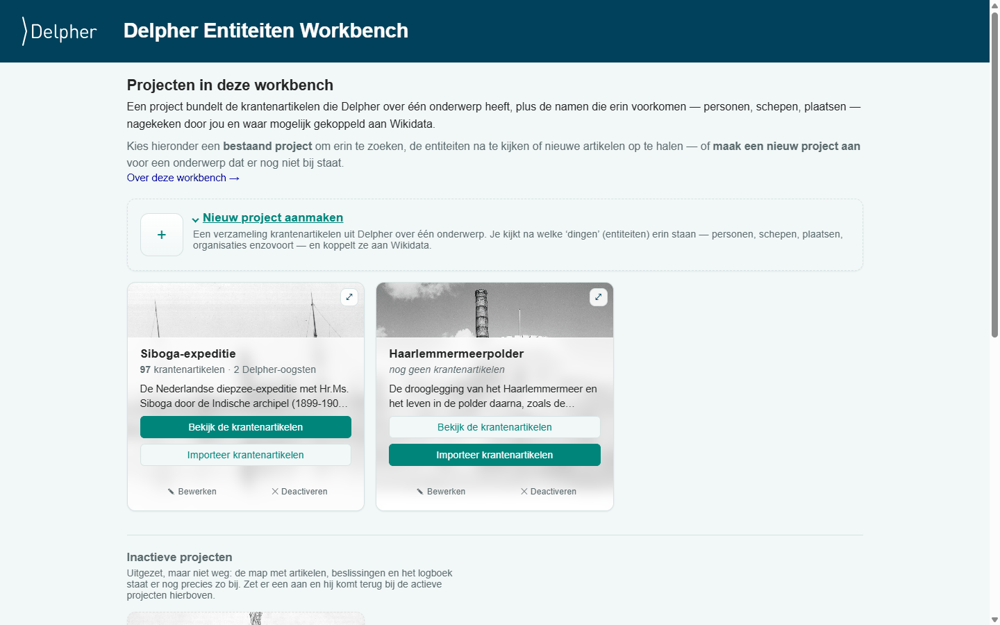
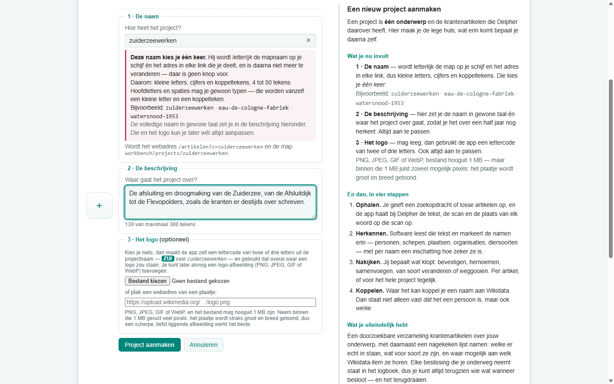
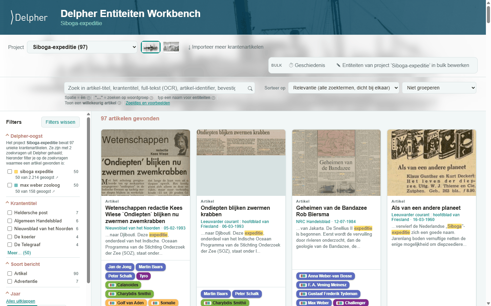
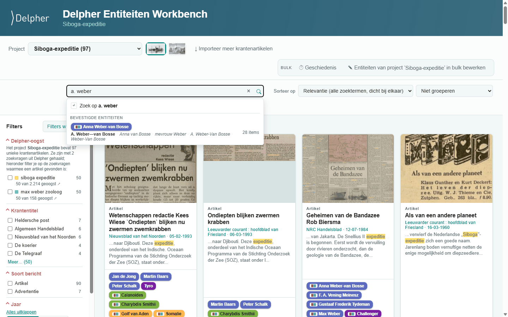
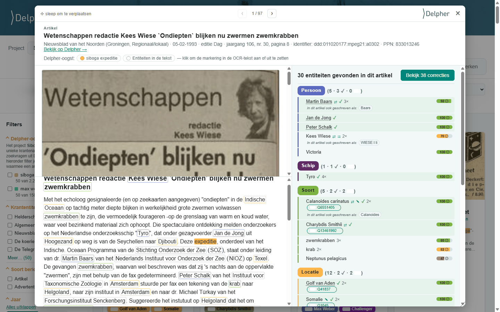
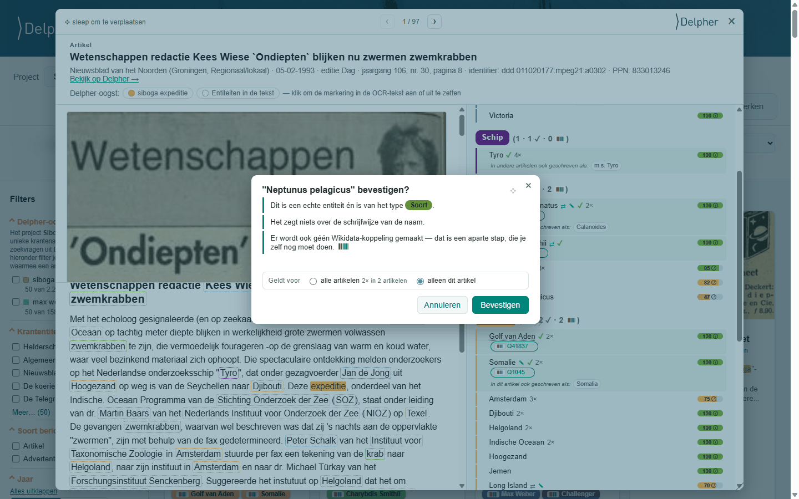
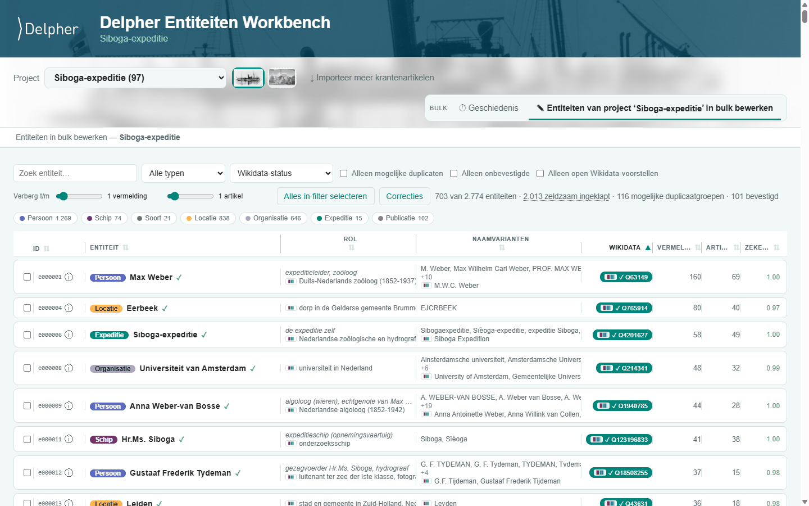
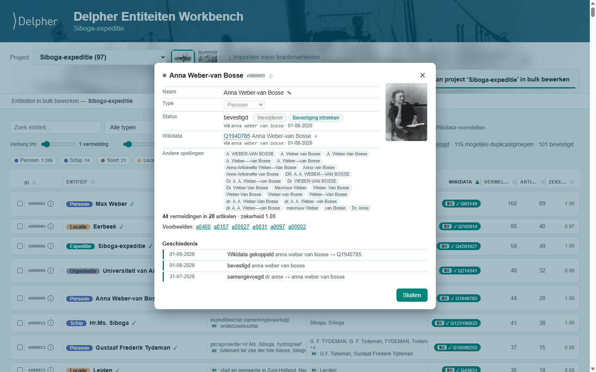

# Delpher entities workbench

  <a href="https://www.delpher.nl" title="Delpher"><picture>
    <source media="(prefers-color-scheme: dark)" srcset="assets/delpher-logo-dark.svg">
    
  </picture></a>
  &nbsp;&nbsp;&nbsp;
  <a href="https://www.kb.nl" title="KB, nationale bibliotheek"><picture>
    <source media="(prefers-color-scheme: dark)" srcset="assets/kb-logo-dark.svg">
    
  </picture></a>
  &nbsp;&nbsp;&nbsp;
  
  &nbsp;&nbsp;&nbsp;
  

Finding named entities — people, ships, species, places, organisations — in
[Delpher](https://www.delpher.nl), the digitised newspaper, book and magazine
portal of the [KB, national library of the Netherlands](https://www.kb.nl);
matching them against [Wikidata](https://www.wikidata.org); and letting a human
review every one of those judgements.

It harvests a Delpher search into a local collection (full OCR text, page
scans, word positions), extracts entities from the text, proposes a Wikidata
item for each, and puts the result in a browsable workbench where you confirm,
correct, merge, split, rename or link them. Every decision is recorded, dated
and reversible.

Built as preparation for [HackaLOD 2026](https://netwerkdigitaalerfgoed.nl/hackalod/)
(Middelburg), the Dutch cultural-heritage / Linked Open Data hackathon run by
Netwerk Digitaal Erfgoed. Its first corpus is the **Siboga expeditie**, the
1899–1900 Dutch marine research expedition through the Indonesian archipelago.

<!--
The gallery links point at raw.githubusercontent.com so a click gives the
full-size picture itself rather than GitHub's file-viewer page. They do NOT
carry target="_blank": GitHub's markdown sanitiser strips that attribute
(measured against its own /markdown API -- it also rewrites rel to nofollow),
so an attribute here would claim a new tab it cannot deliver.
-->

## What it looks like

The eight screens, in the order you meet them. Click any one for the full-size
version.

<!-- GALERIJ:START -- gegenereerd, zie scripts/build_readme_gallery.py -->
<table>
<tr>
<td width="50%" valign="top">

 <b>1 &middot; The project overview at <code>/</code></b> 
One tile per topic, its own logo behind it, and how much it holds. Below the line sit the projects that have been switched off — out of the app, everything still on disk.
</td>
<td width="50%" valign="top">

 <b>2 &middot; The new-project form, with its guide beside it</b> 
Under the name field it says what that name is about to become: the web address, and the folder on disk. The logo block shows the two-or-three-letter code you get if you leave it empty — here <code>ZUI</code>. The four steps on the right are the whole workflow: ophalen, herkennen, nakijken, koppelen.
</td>
</tr>
<tr>
<td width="50%" valign="top">

 <b>3 &middot; The article grid</b> 
The facet column on the left, and cards carrying the page scan, the passage that matched, and the entities a human has confirmed in that article.
</td>
<td width="50%" valign="top">

 <b>4 &middot; Typing <code>a. weber</code> in the search box</b> 
The first row runs it as a text search. Under it, Anna Weber-van Bosse is offered as an entity — matched on a spelling the newspapers print, carrying Wikidata's mark because her identity is settled, and good for 28 articles.
</td>
</tr>
<tr>
<td width="50%" valign="top">

 <b>5 &middot; The article reader</b> 
The page scan top left, the OCR text under it with every entity outlined in its type's colour, and on the right the entity list grouped by type — each row with its confidence, the spellings this article uses, and a Q-id where one has been accepted.
</td>
<td width="50%" valign="top">

 <b>6 &middot; The one dialog every edit goes through</b> 
It says what it is about to assert and what it deliberately does not, and the last line before the buttons is the same choice every time: this article, or all of them — with how often the name occurs, so the wider option is a number rather than a guess.
</td>
</tr>
<tr>
<td width="50%" valign="top">

 <b>7 &middot; The same seven decisions, corpus-wide</b> 
One row per entity, with its type, what Wikidata says it is, every spelling the corpus prints, the accepted Q-id, and how often it occurs. This is where you work through a whole project rather than one article.
</td>
<td width="50%" valign="top">

 <b>8 &middot; One entity, by its id</b> 
The fields you can edit, the portrait Wikidata points at, every spelling, and — at the foot — its history. That last part exists nowhere else: the ledger only holds what is in force now.
</td>
</tr>
</table>
<!-- GALERIJ:EINDE -->

## Where the code is

**Not here, for now.** It is a research tool under active development on one
machine, together with the harvested material and the corrections ledger it
has accumulated. Publishing it is a decision for later.

## What this repo is for

**The issue tracker.** Bugs, feature requests and open questions are collected
at [Issues](https://github.com/KBNLwikimedia/delpher-entities-workbench/issues).
That is the whole purpose of this repo today, so an issue is welcome even
though you cannot read the code it is about.

## Data

Article text, scans and OCR come from Delpher / KB and remain subject to
[Delpher's own terms of use](https://www.delpher.nl/over-delpher/gebruiksvoorwaarden);
the screenshots above show them in that context. Entity data is reconciled
against Wikidata, which is CC0.

## Licence

The code is released under the terms in [LICENSE](LICENSE). Harvested content
remains subject to Delpher/KB's own terms.

---

<!-- LAATST-GEWIJZIGD -->
Last updated: 2026-08-09 · the screenshots above are from that date.
